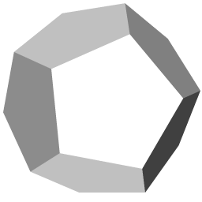

# dodecahedron

Dodecahedron is a simple UCI chess engine. It uses bitboards to implement game rules. It is simple, so it doesn't include sophisticated heuristics or complex position cost functions.

The engine was written by me in the autumn of 2016, and finally I decided to release its code as free software.

The engine state is alpha. It currently lacks some features, such as:

* Time control (the engine doesn't look at the total remaining time and uses only `winc` and `binc` UCI fields to determine thinking time)
* Pondering is also not implemented
* UCI options (such as hash table size, etc.)

# Building

Dodecahedron uses CMake for building. If you are familliar with it, there should be no problem. Just do

~~~
$ mkdir build
$ cd build
$ cmake ..
$ make -j4
~~~

# License

The code is licensed under GNU General Public License, version 3 or (at your option) any later version.
